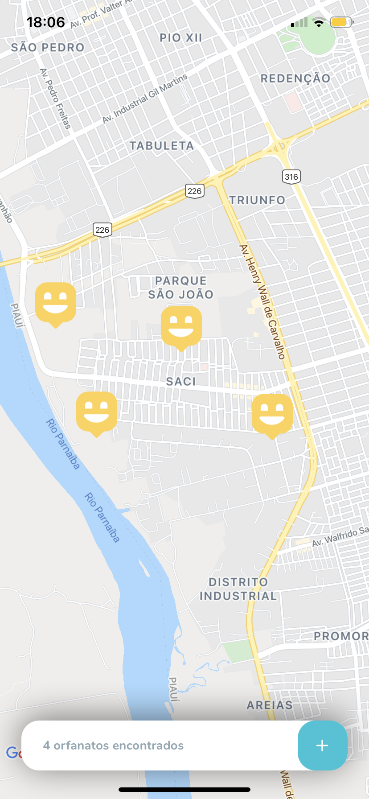
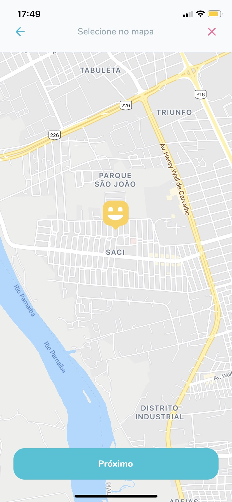
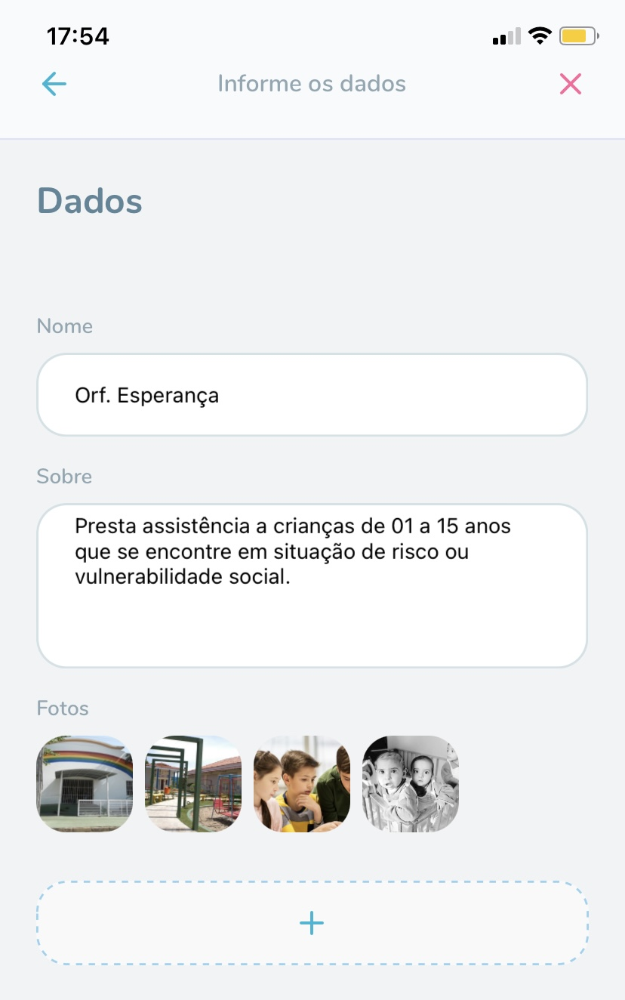
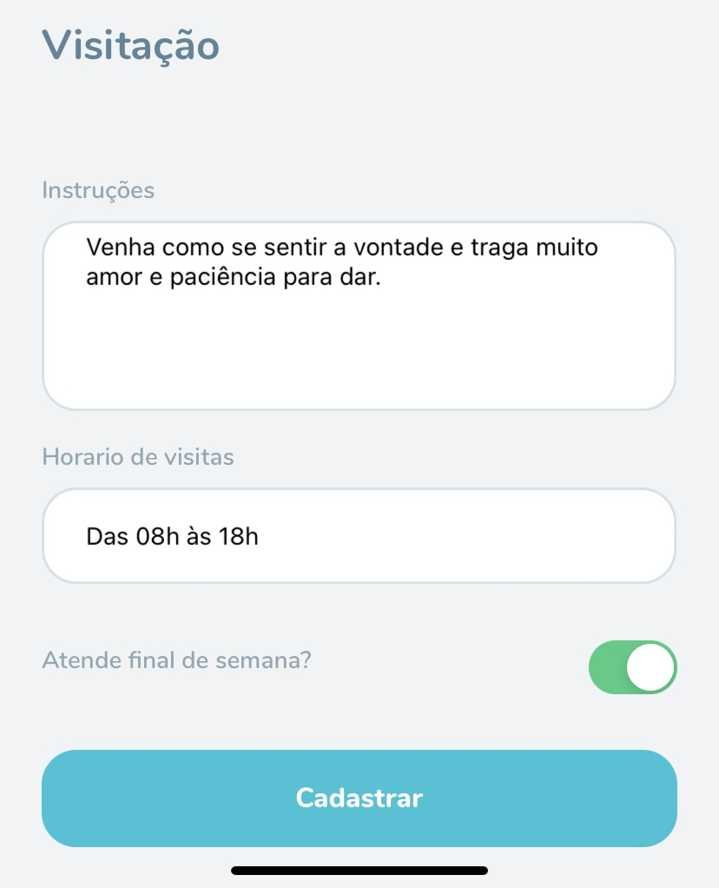
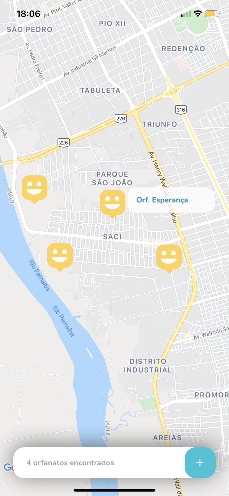
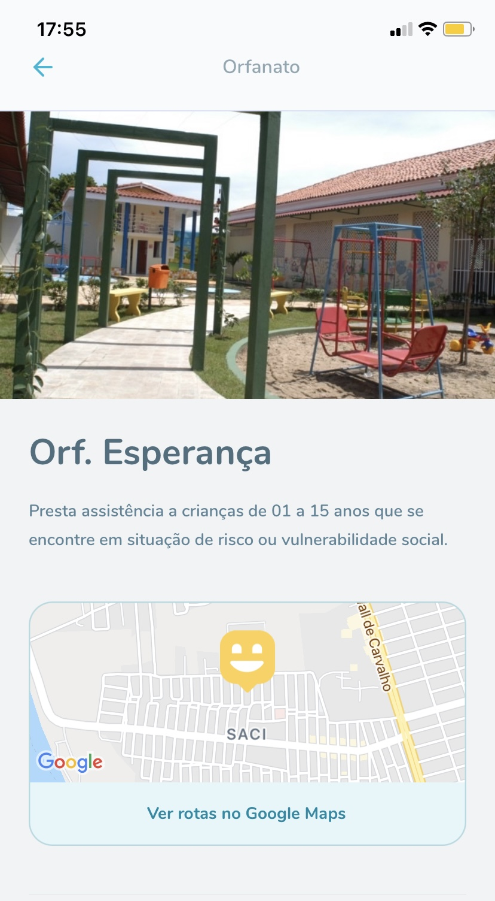
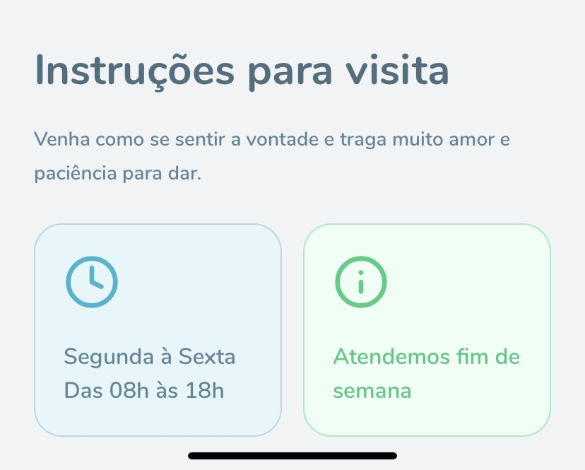

# :rocket: Next Level Week #3 - Mobile :beginner:

O projeto se trata da implementação de uma plataforma que propaga informações sobre os orfanatos existentes em determinada cidade, bem como a maneira correta de visitá-los visando uma melhor experiência para as crianças envolvidas.
O repositório tem como objetivo registrar o conhecimento obtido durante toda a semana. Todos os códigos envolvidos estão comentados de maneira a se extrair o máximo de informação possível das aulas.

# :computer: Screens

## Mapa de Orfanatos

## Cadastrar Orfanato

## Detalhes do Orfanato
## Mapa de Orfanatos

